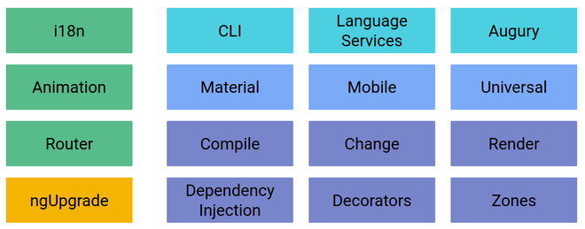

# Presentation

<!-- .slide: class="page-title" -->

Notes :


## Summary

<!-- .slide: class="toc" -->

- **[Introduction](#/1)**
- [Reminders](#/2)
- [Start an Angular application](#/3)
- [Tests](#/4)
- [Template & Components](#/5)
- [Directives](#/6)
- [Dependency Injection](#/7)
- [Pipes](#/8)
- [HTTP Service](#/9)
- [Router](#/10)
- [Forms](#/11)

Notes :


## Presentation

- Framework created by *Google* and announced in 2014
- Total rewriting of the framework
- First version *beta* announced in October 2014
- Version *final* `2.0.0` official release in September 2016
- Latest major release `14.0.0`
- Component Oriented programming
- Framework designed to be more efficient and optimized for mobile
- http://angular.io/

Notes :


## Presentation - Versioning

- Versioning from 2.0.0 to stand out from AngularJS (latest AngularJS being 1.8.2)
- Respect from there of the *semver* standard
- Major versions will no longer be rewrites like 1 to 2
- Skipping version 3.0.0 after the project merge *Router* already in 3.x
- Planning a major release every 6 months in the future


## Versions

| Version | Date | Description |
| :------ | :------: | :------------------------------------------------------------------ |
| 2.0.0 | Sep 2016 | Final version |
| 4.0.0 | Mar 2017 | New template compilation engine, Modularization of the animation system, Universal project, TypeScript 2.1+ |
| 5.0.0 | Nov 2017 | Improvement of the build (AOT), HttpClient, TypeScript 2.3 |
| 6.0.0 | May 2018 | CLI Integration, Angular Element, New experimental Ivy renderer |
| 7.0.0 | Oct 2018 | CLI Prompts, Virtual Scroll, Drag and Drop, Angular Element |
| 8.0.0 | May 2019 | Differential Loading, Dynamic Import, Builders API, Ivy, Bazel |
| 9.0.0 | Feb 2020 | Ivy by default, ProvidedIn scope |


## Versions

| Version | Date | Description |
| :------ | :------: | :------------------------------------------------------------------ |
| 10.0.0 | June 2020 | Optional Stricter Settings, New Default Browser Configuration, TypeScript 3.9 |
| 11.0.0 | Nov 2020 | TypeScript 4.0, Remove deprecated support for IE 9, 10, and IE mobile |
| 12.0.0 | May 2021 | Stylish improvements, nullish coalescing, Webpack 5 support, TypeScript 4.2 |
| 13.0.0 | Nov 2021 | Ivy only remove Old View Engine, Cli Cache, RxJS v7, TypeScript 4.4 |
| 14.0.0 | June 2022 | Strictly Typed Reactive Forms, Standalone Components with Optional NgModule |


## Angular - Positive Points

- Modular application creation
- Usable with several programming languages: `TypeScript` and `Dart` (separate project: https://webdev.dartlang.org/)
- Only three types of elements will be used: `directive`, `pipe` and `services`
- Based on standards: `Web Components`, `ES2015 +`, `Decorator`
- New syntax used in templates
- `Change Detection` API Performance
- The `Universal` Project (server-side rendering)
- Library to start the migration: `ngUpgrade`
- Collaboration with Microsoft and Ember

Notes :
- ES2015 and more ES6 because now there should be a specification every year.
- The next iterations will have less content


## Angular - Negative Points

- New concepts to learn:
  - `Zone`
  - `Observable`
  - ...

Notes :
- New concepts are essential to know (especially Observables).


## Angular = A Platform

- Angular is not just a simple framework
- Mobile Integration
- Tools to facilitate the development phase



Notes :


## Architecture


Notes :


## Architecture

- `Metadata`: Configuration to describe the functioning of a component
- `Component`: TypeScript class that describes its behavior
- `Template`: HTML code rendering using the component
- `Modules`: grouping a set of features
- `Injector`: Angular dependency injection system
- `Directive`: component without template (*ngFor *, *ngIf*, ...)
- `Service`: Business code implemented in classes that will be injected into the different components

Notes :
- The definitions of this slides are related to the previous slide chart


## Architecture - Complete example

- Complete example using the different bricks of an Angular application

```typescript
import {Component} from '@angular/core';
import {HttpClient} from '@angular/common/http';

@Component ({
    selector: 'my-app',
    template: '<div *ngIf="condition">{{value | uppercase}}</div>'
})
export class MyComponent {
  value: string;
  condition: boolean;
  constructor(http: HttpClient) {}
}
```

Notes :
- httpClient is here for injection example
