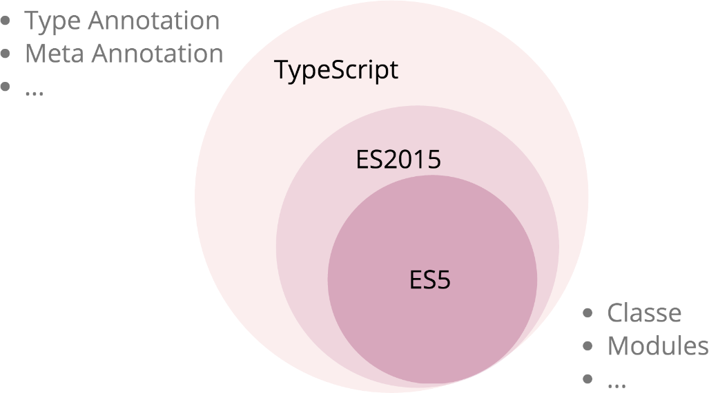

# Rappels

<!-- .slide: class="page-title" -->

Notes :


## Sommaire

<!-- .slide: class="toc" -->

- **[Rappels](#/1)**
- [Présentation](#/2)
- [Démarrer une application Angular](#/3)
- [Tests](#/4)
- [Template & Composants](#/5)
- [Directives](#/6)
- [Injection de Dépendances](#/7)
- [Pipes](#/8)
- [Service HTTP](#/9)
- [Router](#/10)
- [Formulaires](#/11)
- [Server-side Rendering](#/12)
Notes :


## Introduction


- Langage créé par *Anders Hejlsberg* en 2012
- Projet open-source maintenu par *Microsoft* (Version actuelle *2.1*)
- Influencé par *JavaScript*, *Java* et *C#*
- Alternatives : CoffeeScript, Dart, Haxe ou Flow

Notes :


## Introduction

- Phase de compilation nécessaire pour générer du *JavaScript*
- Ajout de nouvelles fonctionnalités au langage *JavaScript*
- Support d'ES3 / ES5 / ES2015
- Certaines fonctionnalités n'ont aucun impact sur le JavaScript généré
- Tout programme *JavaScript* est un programme *TypeScript*



Notes :


## TypeScript - Fonctionnalités

- Fonctionnalités *ES2015+*
- Typage
- Génériques
- Classes / Interfaces  / Héritage
- Développement modulaire
- Les fichiers de définitions
- Mixins
- Décorateurs

Notes :


## Types primitifs

- Pour déclarer une variable :

```typescript
var variableName: variableType = value;
let variableName2: variableType = value;
const variableName3: variableType = value;
```

- boolean : `const isDone: boolean = false;`
- number : `const height: number = 6;`
- string : `const name: string = 'Carl';`
- array : `const names: string[] = ['Carl', 'Laurent'];`
- any : `const notSure: any = 4;`

Notes :


## Fonctions

- Comme en JavaScript : fonctions nommées, anonymes et arrow functions
- Ajout du typage des arguments et de la valeur de retour

```typescript
// Fonction nommée
function namedFunction(arg1: number, arg2: string): void { }

// Fonction anonyme
const variableAnonymousFunction = function(arg: boolean): void { };

// Arrow function
const variableArrowFunction = (arg: any): void => {  };
```

- Peut retourner une valeur grâce au mot clé `return`
- Possibilité d'avoir des paramètres optionnelles ou avec une valeur par défaut

```typescript
function getFullName(name: string = 'Dupont', forename?: string) { }
```

Notes :


## Arrays

- Permet de manipuler un tableau d'objet

- 2 syntaxes pour définir les tableaux : litérale ou par le constructeur

```typescript
// Syntaxe Litérale
let list: number[] = [1, 2, 3];

// Syntaxe utilisant le constructeur `Array`
let list: Array<number> = new Array<number>(1, 2, 3);
```

- Ces 2 syntaxes aboutiront au même code JavaScript

Notes :


## Enum

- Possibilité de définir un type pour expliciter un ensemble de données numériques

```typescript
enum Music { Rock, Jazz, Blues };

let c: Music = Music.Jazz;
```

- La valeur numérique commence par défaut à `0`
- Possibilité de surcharger les valeurs numériques

```typescript
enum Music { Rock = 2, Jazz = 4, Blues = 8 };

let c: Music = Music.Jazz;
```

- Récupération de la chaîne de caractères associée à la valeur numérique

```typescript
let style: string = Music[4]; //Jazz
```

Notes :


## Classes

- Système de *classes* et *interfaces* similaire à la programmation orientée objet
- Le code javascript généré utilisera le système de `prototype`
- Possibilité de définir un constructeur, des méthodes et des propriétés
- Propriétés / méthodes acccessibles via l'objet `this` (toujours explicite)

```typescript
class Person {
  public firstName: string;
  public lastName: string;

  constructor() {}

  public sayHello() {
    console.log(`Hello, I'm ${this.firstName} ${this.lastName}`);
  }
}

let person = new Person();
```

Notes :


## Classes

- Trois scopes disponibles : `public`, `private` et `protected`
- Utilise le scope `public` par défaut
- Scope `protected` apparu en TypeScript 1.3
- Possibilité de définir des propriétés et méthodes statiques : `static`
- Possibilité de définir des propriétés en lecture seule : `readonly`
- Raccourcis pour déclarer et initialiser des propriétés

```typescript
class Person {
  constructor(public firstName: string) { }
}

// ===

class Person {
  public firstName: string;
  constructor(firstName: string) {
    this.firstName = firstName;
  }
}
```

Notes :


## Classes - Accesseurs

- Possibilité de définir des accesseurs pour accéder à une propriété
- Utiliser les mots clé `get` et `set`
- Attention à l'espacement après les mots clé
- Nécessité de générer du code JavaScript compatible ES5
- Le code JavaScript généré utilisera `Object.defineProperty`

```typescript
class Person {
   private _secret: string;
   get secret(): string{
      return this._secret.toLowerCase();
   }
   set secret(value: string) {
      this._secret = value;
   }
}

let person = new Person();
person.secret = 'Test';
console.log(person.secret); // => 'test'
```

Notes :


## Classes - Héritage

- Système d'héritage entre classes via le mot clé `extends`
- Si constructeur non défini, exécute celui de la classe parente
- Possibilité d'appeler l'implémentation de la classe parente via `super`
- Accès aux propriétés de la classe parente si `public` ou `protected`

```typescript
class Person {
   constructor() {}
   speak() {}
 }

class Child extends Person {
 constructor() { super() }
 speak() { super.speak(); }
}
```

Notes :


## Interfaces

- Utilisées par le compilateur pour vérifier la cohérence des différents objets
- Aucun impact sur le JavaScript généré
- Système d'héritage entre interfaces
- Plusieurs cas d'utilisation possible
  - Vérification des paramètres d'une fonction
  - Vérification de la signature d'une fonction
  - Vérification de l'implémentation d'une classe

```typescript
// Les interfaces pour typer facilement
interface Config {
  someProperty: string
}

const config: Config = {
  someProperty: 'myValue'
};
```

Notes :


## Interfaces

- Utilisation la plus connue : implémentation d'une classe
- Vérification de l'implémentation d'une classe
- Erreur de compilation tant que la classe ne respecte pas le contrat défini par l'interface

```typescript
interface Musician {
  play(): void;
}

class TrumpetPlay implements Musician {
  play(): void {
    console.log('Play!');
  }
}
```

Notes :


## Génériques

- Fonctionnalité permettant de créer des composants réutilisables
- Inspiration des génériques disponibles en Java ou C#
- Nécessité de définir un (ou plusieurs) paramètre(s) de type sur la fonction/variable/classe/interface générique

```typescript
function identity<T>(arg: T): T {
    return arg;
}

identity(5).toFixed(2); // Correct

identity('hello').toFixed(2); // Incorrect

identity(true);
```

Notes :


## Génériques

- Possibilité de définir une classe générique
- Définition d'une liste de paramètres de type de manière globale

```typescript
class Log<T> {
    log(value: T) {
        console.log(value);
    }
}

let numericLog = new Log<number>();

numericLog.log(5); // Correct
numericLog.log('hello'); // Incorrect
```

Notes :


## NPM

- Node inclut un système de gestion des paquets : *npm*
- Il existe pratiquement depuis la création de Node.js
- C'est un canal important pour la diffusion des modules


Notes :


## npm install

- `npm` est un outil en ligne de commande (écrit avec Node.js)
- Il permet de télécharger les modules disponibles sur [npmjs.org](npmjs.org)
- Les commandes les plus courantes :
  - `install` : télécharge le module et le place dans le répertoire courant dans `./node_modules`
  - `install -g` : installation globale, le module est placé dans le répertoire d'installation de Node.js

    Permet de rendre accessible des commandes dans la console

    **Attention** : Ne rend pas une librairie accessible pour tous les projets
  - `update` : met à jour un module déjà installé
  - `remove` : supprime le module du projet

Notes :


## npm init

- `npm` gère également la description du projet
- Un module Node.js est un (ou plusieurs) script(s)
- Le fichier de configuration se nomme `package.json`
- `npm` permet également de manipuler le module courant
  - `init` : initialise un fichier `package.json`
  - `docs` : génère la documentation du module en cours
  - `install --save` ou `--save-dev` :

    Comme install mais référence automatiquement la dépendance dans le `package.json`

Notes :


## package.json

- `npm` se base sur un fichier descripteur du projet
- `package.json` décrit précisément le module
- On y trouve différents types d'information
  - Identification
    - `name` : l'identifiant du module (unique, url safe)
    - `version` : doit respecter [node-semver](https://github.com/isaacs/node-semver)
  - Description : `description`, `authors`, ...
  - Dépendances : `dependencies`, `devDependencies`, ...
  - Cycle de vie : scripts `main`, `test`, ...

Notes :
- le nom sera généralement utilisé par require, rester court, tout en étant descriptif
- vérifier si un nom est déjà utilisé par un autre package dans http://registry.npmjs.org/
- le nom est utilisé en fin d'url du module, ne pas utiliser les caractères suivants :
  - ne pas démarrer par un point `.` ou un underscore `_`
  - des caractères non-url-safe
- la version doit être `semver` (Semantic Versioning)
  - Majeure, mineure et patch doivent être numérique
  - il est possible d'y adjoindre un complément informatif (date, numéro de build, ...) qui `ne servira pas` pour le filtrage
  - il existe un outils `semver` permettant de vérifier les contraintes de version


## package.json : dépendances

- `dependencies`

  La liste des dépendances nécessaires à l’exécution

- `devDependencies`

  Les dépendances pour les développements (build, test...)

- `peerDependencies`

  Les dépendances nécessaires au bon fonctionnement du module, mais pas installées lors d'un `npm install` (depuis NPM3)

Notes :
- files : liste de fichiers sauf .npmignore
- bundledDependencies ou bundleDependencies


## package.json : versions

- Les modules doivent suivre la norme [semver](https://www.npmjs.org/doc/misc/semver.html)
  - Structure : `MAJOR.MINOR.PATCH`
  - `MAJOR` : Changements d'API incompatibles
  - `MINOR` : Ajout de fonctionnalité rétro-compatible
  - `PATCH` : Correction de bugs
- Pour spécifier la version d'une dépendance
  - `version` : doit être exactement cette version
  - `~`, `^` : approximativement, compatible
  - `major.minor.x` : `x` fait office de joker
  - [Et bien d'autres](https://www.npmjs.org/doc/misc/semver.html#ranges) : `>`, `<`, `>=`, `min-max`...

Notes :
- \* : n'importe quelle version (dangereux)
- Il est possible de donner une URL, un chemin ou un repository git en version
- vous pouvez conjuguer les `et` et `ou` pour définir des plages de versions complexes


## Publier un module npm

- Il est bien sûr conseillé de suivre toutes les bonnes pratiques
  - Utiliser la numérotation recommandée
  - Avoir des tests unitaires
  - Avoir un minimum d'informations dans le `package.json`
- Il n'y a pas d'autorité de validation
- Il faut par contre trouver un nom disponible
- La suite nécessite seulement la commande `npm`
  - `npm adduser` : enregistrer son compte
  - `npm publish` : uploader un module sur [npmjs.org](https://www.npmjs.org/)

Notes :


<!-- .slide: class="page-questions" -->
