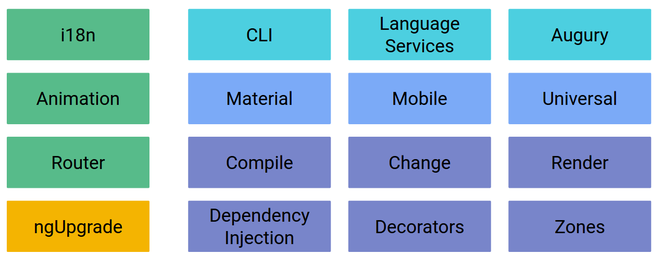

# Présentation

<!-- .slide: class="page-title" -->

Notes :


## Sommaire

<!-- .slide: class="toc" -->

- [Rappels](#/1)
- **[Présentation](#/2)**
- [Démarrer une application Angular2](#/3)
- [Tests](#/4)
- [Template, Directives & Composants](#/5)
- [Les composants Angular2](#/6)
- [Injection de Dépendances](#/7)
- [Les Pipes](#/8)
- [Service HTTP](#/9)
- [Router](#/10)
- [Gestion des Formulaires](#/11)
- [Server-side Rendering](#/12)
- [Bonnes Pratiques pour une migration heureuse](#/13)

Notes :


## Présentation

- Framework créé par *Google* et annoncé en 2014
- Réécriture total du framework
- Reprend certains concepts d'*AngularJS*
- 1e version *beta* annoncée le 23/10/2014
- Version officielle sortie en 2016
- Programmation orientée *Composant*
- Framework conçu pour être plus performant et optimisé pour les mobiles
- http://angular.io/

Notes :


## Points négatifs d'AngularJS

- Différences entre les directives et `ngController`
- Two-way data-binding source de problèmes de performance
- Hiérarchie des scopes
- Pas de server-side rendering
- Plusieurs syntaxes pour créer des services
- API des directives trop complexe
- API mal conçue nécessitant l'utilisant de fix (`ngModelOptions`)

Notes :


## Points négatifs d'AngularJS - directive

- API des directives trop complexe

```javascript
app.directive('MyDirective', function(){
    return  {       
       restrict: 'AE',
       require: '?^^ngModel',
       scope: { variable: '@' },  
       controller: function(...) {},
       link: function(...) { ... }       
    }
});
```

- Version *Angular2* :

```typescript
import { Component, Input} from '@angular/core'
@Component({
  selector: 'my-directive'
})
export class MyDirective {
  @Input() variable:string;
}
```

Notes :


## Points négatifs d'AngularJS - service

- API pour créer des services en *AngularJS*

```javascript
//provider, factory, constant et value
app.service('Service', function(){
  let vm = this;
  vm.myMethod = function(){

  }
});
```

- Version Angular2

```typescript
@Injectable()
export class Service {

  myMethod(){

  }

}
```
Notes :


## Angular2 - Points Positifs

- Création d'application modulaire
- Utilisable avec plusieurs langages de programmation : `ES5`, `ES2015(ES6)`, `TypeScript` et `Dart`
- API plus simple que *AngularJS*
- Seuls trois types d'éléments seront utilisés : `directive`, `pipe` et les `services`
- Basé sur des standards : `Web Component`, `Decorator`, `ES2015`, `ES7`
- Nouvelle syntaxe utilisée dans les templates
- Performance de l'API `Change Detection`
- Le Projet `Universal`
- Librairie pour commencer la migration : `ngUpgrade`
- Collaboration avec Microsoft et Ember

Notes :
- ES2015 et plus ES6 car maintenant il devrait y avoir une spécification chaque année.
- Les prochaines itérations aurons moins de contenu


## Angular2 - Points Négatifs

- Nouvelle phase d'apprentissage du framework
- Faible ecosystème pour l'instant
- Application AngularJS incompatible avec cette nouvelle version
  - ngUpgrade permet de rendre compatible les directives, composant et services
- De nouveaux concepts à apprendre :
  - `Zone`
  - `Observable`
  - `WebPack`...

Notes :
- utilisation de directives 1 dans 2 : https://angular.io/docs/ts/latest/guide/upgrade.html#!#using-angular-1-component-directives-from-angular-2-code
- Les nouveaux concepts ne sont pas indispensables à connaitre. C'est un plus


## Angular2 = Une Plateforme

- Angular2 n'est pas qu'un simple framework
- Intégration Mobile
- Outillage pour faciliter la phase de développement



Notes :


## Architecture

- Architecture d'une application Angular2


Notes :


## Architecture

- Modules : regroupement d'un ensemble de fonctionnalités sous un même namespace
- Library Modules (*barrels*): `@angular/core`, `@angular/http`...
- Les composants : Elément graphique composé d'un template et d'une classe
- Métadata : Moyen d'indiquer à Angular comment utiliser la classe
- Directives : composants sans template (*ngFor*, *ngIf*, ...)
- Services : Code métier implémenté dans des classes qui seront injectées dans les différents composants
- Pipe : Elément permettant de formatter une donnée (équivalent au *filter* d'AngularJS)

Notes :


## Architecture - Exemple complet

- Exemple complet utilisant les différentes briques d'une application Angular2

```typescript
import {Component} from '@angular/core';
import {Http} from '@angular/http';

@Component({
    selector: 'app',
    template: '{{value | MyPipe}}'
})
export class MyComponent{
  value:string;
  constructor(http:Http){
  }
}
```

Notes :


<!-- .slide: class="page-questions" -->
