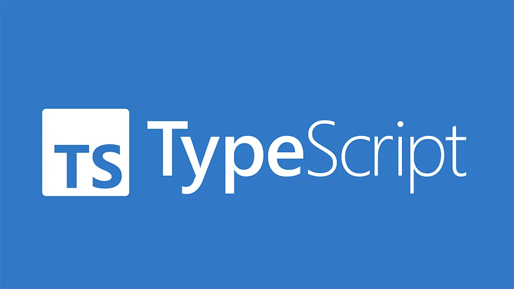

# Reminders

<!-- .slide: class="page-title" -->


## Summary

<!-- .slide: class="toc" -->

- [Introduction](#/1)
- **[Reminders](#/2)**
- [Getting started with Angular](#/3)
- [Components](#/4)
- [Unit testing](#/5)
- [Directives](#/6)
- [Services](#/7)
- [Pipes](#/8)
- [Http](#/9)
- [Router](#/10)
- [Forms](#/11)

Notes :


## HTML

- Basic HTML document is made of:
  - *Tags*
  - *Attributes*

```html
<!doctype html>
<html lang="en">
  <head>
    <meta charset="UTF-8" />
    <meta name="viewport" content="width=device-width, initial-scale=1.0" />
    <title>Hello world!</title>
  </head>

  <body>
    <h1>Hello world!</h1> <!-- Tag with content -->

     <!-- Self closing tag -->
  </body>
</html>
```

Notes :


## CSS

- Basic CSS file is made of:
  - *Selectors*
  - *Rules* (any number of *property*/*value* pairs)

- The following HTML fragment (`*.html`)...

```html
<my-tag class="my-class" my-attr>My content</my-tag>
```

- ...can be styled using the following (`*.css`)

```css
my-tag { border: 1px solid green; } /* Tag selector */

.my-class { background-color: lightgreen; } /* Class selector */

[my-attr] { color: yellow; } /* Attribute selector */
```

Notes :


## Typescript

- Language created by *Anders Hejlsberg* in 2012
- Open-source project maintained by *Microsoft*
- Influenced by *Java* and *C#*

<br />


Notes :


## Typescript

- TypeScript is a superset of *JavaScript*
- Compiles to *JavaScript*
- Supports all versions of JavaScript
- Almost every *JavaScript* program is a *TypeScript* program


Notes :


## TypeScript - Features

- Types
- Interfaces
- Generics
- Decorators
- Definitions files
- ...

Notes :


## Typescript - Basic types

Two ways to define variables: `const` and `let` (don't use `var`)

```ts
const alwaysTrue: boolean = true;
let age: number = 32;
age = 33;
```

There are several places where type inference is used to provide type information when there is no explicit type annotation:

```ts
const alwaysTrue = true; // is still of type boolean
let age = 32;            // is still of type number
age = 33;
```

Some other types:

```ts
const name: string = 'Carl';
const names1: string[] = ['Carl', 'Laurent'];
const names2: Array<string> = ['Carl', 'Laurent'];
const notSure: any = 4; // <-- should be avoided
```

Notes :


## Typescript - Functions

- As in JavaScript: *named*, *anonymous* and *arrow* functions
- TypeScript allows typing for arguments and return value

```ts
function sayHello(message: string): void {}

const sayHello = function(message: string): void {};

const sayHello = (message: string): void => {};
```

- Define default value parameter with `=`
- Define optional parameter with `?`
- Use `return` keyword to return a value

```ts
function getFullName(lastName: string = 'Dupont', firstName?: string) {
  return firstName ? `${firstName} ${lastName}` : lastName;
}
```

Notes :
Default value parameter have their value replaced only when equals to undefined (null is a valid value)


## Typescript - Classes

- *Classes* and *Interfaces* are similar to those in Object Oriented Programming
- Classes are composed of one constructor, properties and methods
- Explicitly defining a constructor is optional
- Properties and methods are accessible with `this` operator

```ts
class Person {
  name = '';

  constructor() {} // this is optional

  sayHello() {
    console.log(`Hello, I'm ${this.name}!`);
  }
}

const person = new Person();
person.name = 'Carl';
person.sayHello(); // --> Hello, I'm Carl!
```

Notes :


## Typescript - Classes

- 3 scopes: `public`, `protected` and `private`
  - `public` is the default scope
  - `private` scope alternative: using standard JavaScript private field (using hash `#` prefix)

```ts
class Demo {
  prop1 = 1;
  protected prop2 = true;
  private prop3 = 'Secret';

  #prop4 = 'Big secret'; // <-- standard JavaScript private field

  method1() {}
  protected method1() {}
  private method3() {}

  #method4() {} // <-- standard JavaScript private field
}
```

Notes :


## Typescript - Classes

- TypeScript provides a shortcut to link constructor arguments to class properties:

```ts
class Person {
  constructor(public firstName: string) {}
}
```

Which is equivalent to:

```ts
class Person {
  public firstName: string;

  constructor(firstName: string) {
    this.firstName = firstName;
  }
}
```

Notes :


## Typescript - Classes

- Possibility to have "getter" and "setter":

```ts
class Person {
  constructor(public firstName: string, public lastName: string) {}

  get fullName(): string {
    return `${this.firstName} ${this.lastName}`;
  }

  set fullName(value: string): void {
    const [firstName, lastName] = value.split(' ');
    this.firstName = firstName;
    this.lastName = lastName;
  }
}

const person = new Person('John', 'Doe');
console.log(person.fullName); // --> John Doe

person.fullName = 'Jean Dupont';
console.log(person.firstName); // --> Jean
console.log(person.lastName); // --> Dupont
```

Notes :


## Typescript - Interfaces

- Can be used to define object shape:

```ts
interface Person { name: string; age: number; }

const person: Person = { name: 'John Doe', age: 33 };
```

- Can be used on classes with the `implements` keyword:

```ts
interface Musician {
  play(): void;
}
class TrumpetPlayer implements Musician {
  play(): void {
    console.log('I play trumpet!');
  }
}
```

- Compiler throw an error while the interface contract is not respected
- Have no impact on generated JavaScript

Notes :


## Typescript - Generics

- Similar to generics in *Java* or *C#*
- Generic functions/variables/classes/interfaces need typing at instantiation

```ts
class Log<T> {
  log(value: T) {
    console.log(value);
  }
}

const numericLog = new Log<number>();

numericLog.log(5); // Correct

numericLog.log('hello'); // Incorrect
```

Notes :


## NPM - Node Package Manager

- Included in Node.js
- The main way to share modules in JavaScript
- The most popular package manager of all time!

<br />


Notes :


## NPM - Commands

- Set up a folder as an npm package by creating a `package.json` file

```shell
npm init
```

- Download a module and install it in `./node_modules` directory

```shell
npm install <packageName>
```

- Install a module globally on your system (mostly used to install CLI tools)

```shell
npm install -g <packageName>
```

- Update/delete a package

```shell
npm update <packageName>
npm remove <packageName>
```

Notes :


## NPM - package.json

- npm generate a `package.json` file which describes the project:
  - `name`: package name
  - `version`: package version
  - `scripts`: commands that can be run from the command line
  - Dependencies: `dependencies`, `devDependencies`, `peerDependencies`
  - ...

```json
{
  "name": "<packageName",
  "version": "1.2.3",
  "scripts": {},
  "dependencies": {},
  "devDependencies": {}
}
```

Notes :


## NPM - package.json | Scripts

- Scripts are defined in the `"scripts"` section of the file:

```json
{
  "scripts": {
    "start": "<shellCommand>",
    "test": "<shellCommand>",
    "my-awesome-script": "<shellCommand>",
  }
}
```

- And can be run with the command `npm run <scriptName>`:

```shell
npm run start             # alias: `npm start`
npm run test              # alias: `npm test`
npm run my-awesome-script
```

Notes :


## NPM - package.json | Dependencies

- `dependencies`:
  - Required to run your project

- `devDependencies`:
  - Required to develop your project
  - Installed with the option: `npm install --save-dev <packageName>`

- `peerDependencies`: 
  - Needed for some modules to work but not installed with `npm install`
  - Typically used for libraries

Notes :


## NPM - package.json | Versioning

`package.json` versions must follow the [semver](https://github.com/isaacs/node-semver) (semantic versioning) standard

```json
{
  "name": "<packageName>",
  "version": "<major>.<minor>.<patch>"
}
```

- `major`: Might introduce breaking changes
- `minor`: Can add new features but in a retro-compatible way
- `patch`: Bug fixes

Example: 

```json
{
  "name": "my-awesome-package",
  "version": "1.2.3"
}
```

Notes :


## NPM - package.json | Versioning

Allowing a range of versions when installing a package

- `1.2.3`: Install the exact version
- `~1.2.3`: Install any patch like `1.2.4`, `1.2.5`, ..., `1.2.9`
- `^1.2.3`: Install any minor version like `1.2.3`, `1.3.0`, ..., `1.9.0`
- `1.2.x`: `x` acts as a wildcard (equivalent to `~1.2.0`)

There are [many other ways](https://docs.npmjs.com/about-semantic-versioning) to set the version range using `<`, `>`, `>=`, `min-max` ...

Notes :
- It is possible to give a URL, a path or a repository git in version


<!-- .slide: class="page-questions" -->
