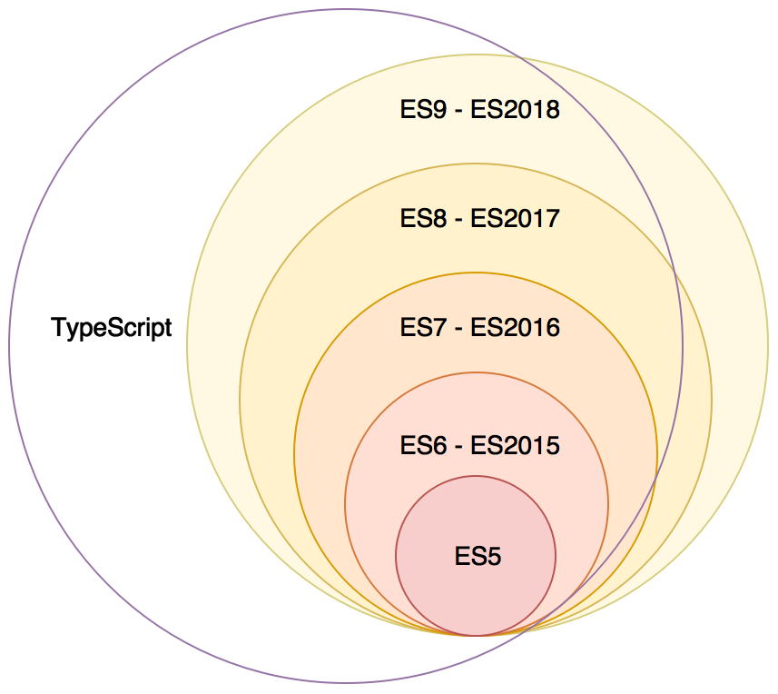

# Reminders

<!-- .slide: class="page-title" -->

Notes :


## Summary

<!-- .slide: class="toc" -->

- [Introduction](#/1)
- **[Reminders](#/2)**
- [Start an Angular application](#/3)
- [Tests](#/4)
- [Template & Components](#/5)
- [Directives](#/6)
- [Dependency Injection](#/7)
- [Pipes](#/8)
- [HTTP Service](#/9)
- [Router](#/10)
- [Forms](#/11)

Notes :


## Introduction


- Language created by *Anders Hejlsberg* in 2012
- Open-source project maintained by *Microsoft* (Current version *4.0*)
- Influenced by *JavaScript*, *Java* and *C#*
- Alternatives: CoffeeScript, Dart, Haxe or Flow

Notes :


## Introduction

- Compilation phase needed to generate *JavaScript*
- Added new features to the language *JavaScript*
- ES3/ES5/ES2015 support
- Some features have no impact on the generated JavaScript
- Any program *JavaScript* is a *TypeScript program*



Notes :


## TypeScript - Features

- Features *ES2015 +*
- Typing
- Generic
- Classes/Interfaces/Legacy
- Modular development
- Definition files
- Mixins
- Decorators

Notes :


## Primitive types

- To declare a variable:

```typescript
var variableName: string = value;
let variableName2: number = value;
const variableName3: boolean = value;
```

- boolean: `const isDone: boolean = false;`
- number: `const height: number = 6;`
- string: `const name: string = 'Carl';`
- array: `const names: string [] = ['Carl', 'Laurent'];`
- any: `const notSure: any = 4;`

Notes :


## Features

- As in JavaScript: named, anonymous and arrow functions
- Added typing of arguments and return value

```typescript
// named function
function namedFunction(arg1: number, arg2: string): void {}

// Anonymous function
const variableAnonymousFunction = function(arg: boolean): void {};

// Arrow function
const variableArrowFunction = (arg: any): void => {};
```

- Can return a value thanks to the keyword `return`
- Possibility to have optional parameters or with a default value

```typescript
function getFullName(name: string = 'Dupont', forename?: string) {}
```

Notes :


## Arrays

- Allows to manipulate an array of objects

- 2 syntaxes to define the arrays: literal or by the constructor

```typescript
// Syntax Literal
const list: number [] = [1, 2, 3];

// Syntax using the `Array` constructor
const list: Array<number> = new Array<number>(1, 2, 3);
```

- These 2 syntaxes will lead to the same JavaScript code

Notes :


## Enum

- Ability to define a type to explain a set of numeric data

```typescript
enum Music {Rock, Jazz, Blues};

const c: Music = Music.Jazz;
```

- Numeric value defaults to `0`
- Ability to overload numerical values

```typescript
enum Music {Rock = 2, Jazz = 4, Blues = 8};

const c: Music = Music.Jazz;
```

- Retrieving the string associated with the numeric value

```typescript
const style: string = Music[4]; //Jazz
```

Notes :


## Classes

- System of *classes *and* interfaces* similar to object-oriented programming
- The generated javascript code will use the `prototype` system
- Ability to define a constructor, methods and properties
- Properties/methods accessible via the `this` object (always explicit)

```typescript
class Person {
  firstName: string;
  lastName: string;

  constructor() {}

  sayHello() {
    console.log(`Hello, I'm ${this.firstName} ${this.lastName}`);
  }
}

const person = new Person ();
```

Notes :


## Classes

- Three scopes available: `public`, `private` and `protected`
- Use default `public` scope
- Scope `protected` appeared in TypeScript 1.3
- Possibility of defining static properties and methods: `static`
- Ability to set read-only properties: `readonly`
- Shortcuts to declare and initialize properties

```typescript
class Person {
  constructor(public firstName: string) {}
}
// ===
class Person {
  firstName: string;
  constructor(firstName: string) {
    this.firstName = firstName;
  }
}
```

Notes : 
readonly does not mean immutable


## Classes - Accessors

- Ability to define accessors to access a property
- Use the `get` and `set` keywords
- Watch out for spacing after keywords
- Need to generate ES5 compatible JavaScript code
- The generated JavaScript code will use `Object.defineProperty`

```typescript
class Person {
   private _secret: string;
   get secret (): string {
      return this._secret.toLowerCase();
   }
   set secret (value: string) {
      this._secret = value;
   }
}

const person = new Person ();
person.secret = 'Test';
console.log(person.secret); // => 'test'
```

Notes :


## Classes - Inheritance

- Inheritance system between classes via the keyword `extends`
- If undefined constructor, execute that of the parent class
- Ability to call the implementation of the parent class via `super`
- Access the properties of the parent class if `public` or `protected`

```typescript
class Person {
   constructor() {}
   speak() {}
 }

class Child extends Person {
 constructor() {super ()}
 speak() {super.speak(); }
}
```

Notes :


## Interfaces

- Used by the compiler to check the consistency of different objects
- No impact on the generated JavaScript
- Inheritance system between interfaces
- Several possible use cases
  - Checking the parameters of a function
  - Checking the signature of a function
  - Checking the implementation of a class

```typescript
// The interfaces for typing easily
interface Config {
  someProperty: string
}

const config: Config = {
  someProperty: 'myValue'
};
```

Notes :


## Interfaces

- Best known use: class implementation
- Checking the implementation of a class
- Compilation error as long as the class does not respect the contract defined by the interface

```typescript
interface Musician {
  play(): void;
}

class TrumpetPlay implements Musician {
  play(): void {
    console.log('Play!');
  }
}
```

Notes :


## Generics

- Functionality to create reusable components
- Inspiration of generics available in Java or C #
- Need to define one (or more) type parameter(s) on function/variable/class/generic interface

```typescript
function identity<T>(arg: T): T {
    return arg;
}

identity(5).toFixed(2); // OK

identity('hello').toFixed(2); // Incorrect
```

Notes :


## Generics

- Ability to define a generic class
- Defining a list of type parameters globally

```typescript
class Log<T>{
    log(value: T) {
        console.log(value);
    }
}

const numericLog = new Log <number> ();

numericLog.log(5); // OK
numericLog.log('hello'); // Incorrect
```

Notes :


## npm

- Node.js includes a package management system: *npm*
- There is practically since the creation of Node.js
- It is an important channel for the diffusion of the modules


Notes :


## npm install

- `npm` is a command line tool (written with Node.js)
- It allows to download the modules available on [npmjs.org](npmjs.org)
- The most common orders:
  - `install`: download the module and place it in the current directory in `./node_modules`
  - `install -g`: global installation, the module is placed in the installation directory of Node.js

    Make commands accessible in the console

**Attention**: Does not make a bookstore accessible for all projects
  - `update`: update an already installed module
  - `remove`: delete the project module

Notes :


## npm init

- `npm` also manages the project description
- A Node.js module is one (or more) script (s)
- The configuration file is named `package.json`
- `npm` also allows to manipulate the current module
  - `init`: initialize a `package.json` file
  - `docs`: generates the documentation for the current module
  - `install <moduleName>` or `install <moduleName> --save-dev`:

    Like install but automatically reference the dependency in `package.json`

Notes :


## package.json

- `npm` is based on a project descriptor file
- `package.json` precisely describes the module
- There are different types of information
  - Identification
    - `name`: the identifier of the module (unique, url safe)
    - `version`: must respect [node-semver](https://github.com/isaacs/node-semver)
  - Description: `description`, `authors`, ...
  - Dependencies: `dependencies`, `devDependencies`, ...
  - Lifecycle scripts: `start`, `test`, ...

Notes :


## package.json: dependencies

- `dependencies`

  The list of dependencies needed for execution

- `devDependencies`

  Dependencies for developments (build, test ...)

- `peerDependencies`

  The dependencies necessary for the proper functioning of the module, but not installed during an `npm install` (since npm3)

Notes :
- files: list of files except .npmignore
- bundledDependencies or bundleDependencies


## package.json: versions

- The modules must follow the standard [semver](https://www.npmjs.org/doc/misc/semver.html)
  - Structure: `MAJOR.MINOR.PATCH`
  - `MAJOR`: Incompatible API Changes
  - `MINOR`: Added retro-compatible feature
  - `PATCH`: Bug fixes
- To specify the version of a dependency
  - `version`: must be exactly this version
  - `~`, `^`: approximately, compatible
  - `major.minor.x`:` x` acts as a wildcard
  - [And many others](https://docs.npmjs.com/cli/v6/using-npm/semver#ranges): `>`, `<`, `> =`, `min-max` .. .

Notes :
- \ *: any version (dangerous)
- It is possible to give a URL, a path or a repository git in version
- you can conjugate `and` or `or` to define complex version ranges


## Publish a module npm

- It is of course advisable to follow all good practices
  - Use the recommended numbering
  - Have unit tests
  - Have a minimum of information in the `package.json`
- There is no validation authority
- You must find a name available
- Next only requires the `npm` command
  - `npm adduser`: register his account
  - `npm publish`: upload a module on [npmjs.org](https://www.npmjs.org/)

Notes :
