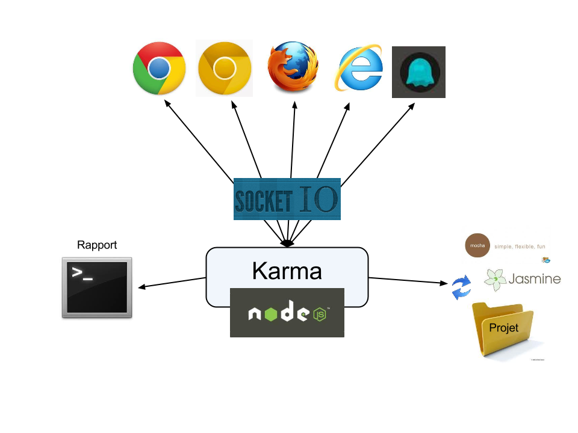

# The tests

<!-- .slide: class="page-title" -->

Notes :


## Summary

<!-- .slide: class="toc" -->

- [Reminders](#/1)
- [Presentation](#/2)
- [Start an Angular application](#/3)
- **[Tests](#/4)**
- [Template & Components](#/5)
- [Directives](#/6)
- [Dependency Injection](#/7)
- [Pipes](#/8)
- [HTTP Service](#/9)
- [Router](#/10)
- [Forms](#/11)
- [Server-side Rendering](#/12)

Notes :


## Concepts

- In the `Jasmine` documentation is used as a test framework
  - `Angular` can also be tested with other frameworks
- To run the tests easily, we propose to use `Karma`
  - It was developed by `AngularJS` team
  - It is neither essential nor related to `Angular`
- `Jasmine` and` Karma` are the tools used in an application generated with Angular CLI

Notes :


## Jasmine


- Test framework: http://jasmine.github.io/
- No dependency on other frameworks
- Does not require *DOM* elements

Notes :


## Jasmine - Structure

- `describe` and` it` functions to describe the test suite
- *matchers* system: `toBe`, `toBeUndefined`, `toBeTruthy`, `toThrow`, ...
- Ability to use an external library as `Chai`

```Javascript
describe('True value', () => {

  it ('should be equal to true', () => {

     expect(true).toBe(true);

  });

});
```

Notes :


## Jasmine - Hooks

- `beforeEach`, `afterEach`, `beforeAll`, `afterAll`
- Performing a function before or after each or all tests

```Javascript
describe('True value', function() {
  let value;

  beforeEach (function() {
    value = true;
  });

  it ('should be equal to true', function() {
    expect(value).toBe(true);
  });
});
```

Notes :


## Jasmine - Spies

- Jasmine offers a system of *Spies* included
- It is also possible to use an external library like *Otherwise*
- Create a spy: `jasmine.createSpy ()` or `spyOn (someObj)`
- Spy matchers: `toHaveBeenCalled`, `toHaveBeenCalledWith`, `and.callThrough`, `and.returnValue`, `and.callFake`, `mySpy.calls` ...

```Javascript
describe('Object service:', function() {

  it ('checkout method should be called', function() {
     spyOn (service, 'foo');
     service.foo();
     expect(service.foo).toHaveBeenCalled();
  });

});
```

Notes :


## Jasmine - TypeScript

- Ability to write tests *Jasmine * in * TypeScript*

```typescript
class True {
  returnTrue () {
    return true;
  }
}

describe('True object:', () => {
  describe('returnTrue method:', () => {
    it ('should return true', () => {
      const trueObject: True = new True ();
      expect(trueObject.returnTrue()).toBe(true).
    });
  });
});
```

Notes :


## Karma

- *Karma* is a tool that automates the execution of tests

<Figure>
    
</ Figure>

Notes :


## With Angular CLI

- Automatic configuration by *Angular CLI*
- The following tools are ready to work together:

  *Webpack *, * TypeScript *, * Angular *, * Jasmine *, * Karma*
- The test files are automatically created with `ng generate (...)`

  `Component` /` Service`/`Pipe`
- They are in the same directory as the item to be tested

  *My*-service.spec.ts
- Execution of tests:

```Shell
ng test
```

Notes :


<!-- .slide: class="page-tp2" -->
