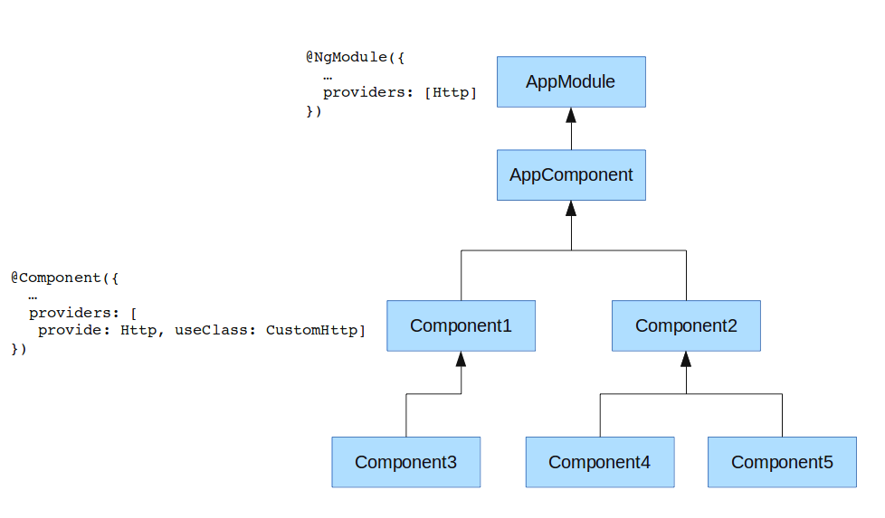

# Injection of <br> Dependencies

<!-- .slide: class="page-title" -->

Notes :


## Summary

<!-- .slide: class="toc" -->

- [Reminders](#/1)
- [Introduction](#/2)
- [Start an Angular application](#/3)
- [Tests](#/4)
- [Template & Components](#/5)
- [Directives](#/6)
- **[Dependency Injection](#/7)**
- [Pipes](#/8)
- [HTTP Service](#/9)
- [Router](#/10)
- [Forms](#/11)
- [Server-side Rendering](#/12)

Notes :


## Injectors

- Technical components used to inject the services
- Many injectors collaborating

  (Unlike *AngularJS* which has only one global injector)
- Components inherit the injector from their parent
- Need to configure the injectors
  - globally via the `@NgModule` main module
  - locally via `@Component`
- **Within the same injector** the services are *singletons*

Notes :


## Injector's Global configuration

- `@NgModule` has a `providers` property to add services
- The services registered in a module are injectable in all the components of this module or of a module which `import` this module

```typescript
// application.component.ts file
import {UserService} from './user.service'

@Component ({...})
export class AppComponent {
  constructor(private userService: UserService) {
    console.log(userService.getUser());
  }
}
```

```typescript
// app.module.ts file
import {AppComponent} from './application.components';
import {UserService} from './user.service';

@NgModule ({
  declarations: [AppComponent],
  providers: [UserService]
})
export class AppModule {}
```

Notes :


## Injector's Local configuration

- Ability to use the `providers` property in the `@Component` annotation
- Same syntax as the global configuration
- The services defined in a `Component` are injectable in this component and its threads
- Not recommended for the use of `NgModule`

```typescript
// application.component.ts file
import {UserService} from './user.service'

@Component ({
  providers: [UserService]
})
export class AppComponent {
  constructor(private userService: UserService) {
    console.log(userService.getUser());
  }
}
```

Notes :


## Service

- An *Angular* service is nothing more than a TypeScript class
- Without annotation, the service does not benefit from the dependency injection
- Need to add annotation `@Injectable`
- Not necessary for components, it's implicit with `@Component`

```typescript
import {Injectable} from '@angular/core';
import {Logger} from './logger-service';

@Injectable()
export class UserService {
    constructor(private logger: Logger) {}

    getUsers(): Promise<User> {
      this.logger.log('getUsers called!');
      ...
    }
}
```

Notes :
- The documentation states that it is (very) good practice to annotate all services with @Injectable, even those with no dependency (see here: https://angular.io/guide/dependency-injection).
- Ability to have optional dependencies (using the @Optional () annotation on the parameter).


## Configure the providers

- A provider is a description for the injector:

  how to get an instance of the requested element

- It is impossible to use interfaces in the provider identifier

```typescript
export function serverConfigFactory(appService: AppService) {
  return appService.getConfig();
}

@NgModule ({
  providers: [
    UserService, // The simplest and most common: a class
    {
      provide: LoginService, // For an element of this type
      useClass: LoginServiceImpl // Use this class (or implementation)
    },
    {
      provide: ServerConfig, // for an element of this type
      useFactory: serverConfigFactory, // use a factory function
      deps: [AppService] // The factory can even have injections
    }
  ]
})
export class AppModule {}
```

Notes :


## Configure the providers

- By default the injection is based on the types of parameters
- Impossible for values ​​such as `string` or `number`
- Ability to define a string of characters as identifier
- Need to use the `Inject` annotation to inject this kind of values

```typescript
const apiUrl: string = 'api.heroes.com';
const env: string = 'dev';

@NgModule ({
  declarations: [AppComponent],
  providers: [
    {provide: 'apiUrl', useValue: apiUrl},
    {provide: 'env', useValue: env}
  ]
})
export class AppModule {}

class AppComponent {
  constructor(@Inject ('apiUrl') private API: string) {...}
}
```

Notes :


## Service providedIn

- Since angular 6, it is no longer necessary to declare a service in a module if we add the `providedIn: 'root'` option in the `@Injectable` annotation:

```typescript
@Injectable({
  providedIn: 'root'
})
export class UserService {

  constructor() {}
}
```

- If you can add the service in another module, just give the module you want in the `providedIn: MyModule` option
- Since Angular 9 two more options are available: `any` and `plateform`


## Hierarchy of injectors

- Each injector contains a number of providers
- Each injector manages a singleton for each provider
- During an injection of dependency
  - The local injector tries to find a compatible provider
  - If he does not find, he transmits the request to his parent
  - So on until the main injector of the application
  - If no provider could be found, *Angular* displays an error
- This mechanism is very powerful but can be complex
  - Possibility of local overrides to services
  - But can also mask the good service inadvertently


## Hierarchy of injectors



Notes :
  - Http service sets as singleton for the app, it will be used by AppComponent, Component2, Component4, Component5
  - If Component1 or Component3 injects Http, it's a CustomHttp that will be injected (singleton for Component1 and Component3)
  - If Component3 also defines the same provider array as Component3, then each will have a different instance of CustomHttp


## Tests

- Add the `providers` of the TestBed test module
- Do not hesitate to overload "**mock**" services
- Powerful mechanism that isolates the element that we want to test
- Two utilities available:
  - `TestBed.inject (ClassName)` (`TestBed.get` is deprecated since Angular 9)

    Retrieves the service instance given as parameter
  - `async (fn: Function)`

    Automatically retards the test against asynchronous actions

    (works thanks to **ZoneJS**)


## Tests

- Test example using the providers
- Suppose `UserService` uses `LoggerService`

```typescript
import {TestBed, async} from '@angular/core/testing';
import {UserService} from './user.service';

describe('UserService', () => {
  beforeEach (() => {
    TestBed.configureTestingModule ({
      providers: [
        UserService,
        {provide: LoggerService, useValue: {log: jasmine.createSpy ()}}
      ]
    });
  });

  it ('should return 1 user', async(() => {
    const service = TestBed.inject (UserService);
    service.getUsers().then(users => {
      expect(users.length).toBe(1);
    });
  }));
});
```

Notes :


<!-- .slide: class="page-tp5" -->
