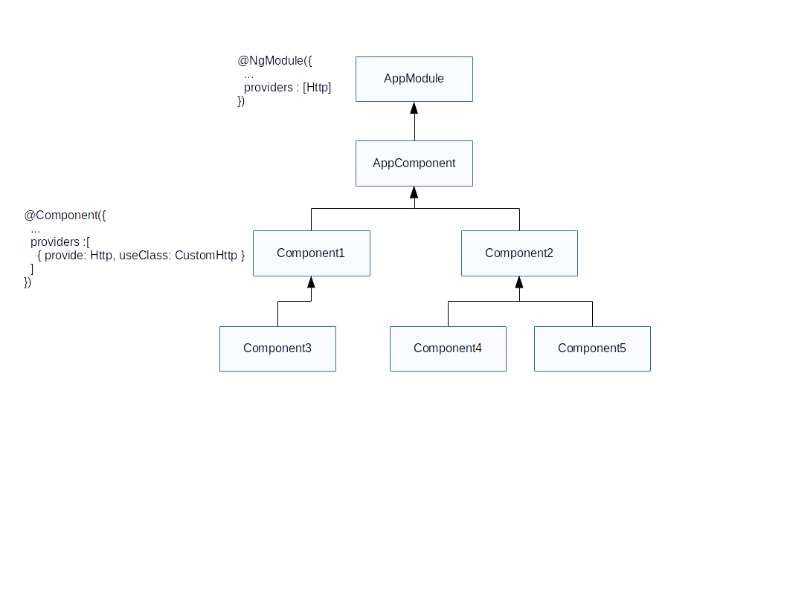

# Injection de<br>Dépendances

<!-- .slide: class="page-title" -->

Notes :


## Sommaire

<!-- .slide: class="toc" -->

- [Rappels](#/1)
- [Présentation](#/2)
- [Démarrer une application Angular](#/3)
- [Tests](#/4)
- [Template & Composants](#/5)
- [Directives](#/6)
- **[Injection de Dépendances](#/7)**
- [Pipes](#/8)
- [Service HTTP](#/9)
- [Router](#/10)
- [Formulaires](#/11)
- [Server-side Rendering](#/12)

Notes :


## Injecteurs

- Composants techniques utilisés pour injecter les services
- Nombreux injecteurs qui collaborent

  (Contrairement à *AngularJS* qui n'a qu'un unique injecteur global)
- Les composants héritent de l'injecteur de leur parent
- Nécessité de configurer les injecteurs
  - de manière globale via le module principal `@NgModule`
  - de manière locale via `@Component`
- **Au sein du même injecteur** les services sont des *singletons*

Notes :


## Configuration globale de l'injecteur

- `@NgModule` a une propriété `providers` pour ajouter les services
- Les services inscrits dans un module sont injectable dans tous les composants de ce module ou d'un module qui `import` ce module

```typescript
// fichier application.component.ts
import { UserService } from './user.service'

@Component({ ... })
export class AppComponent {
  constructor(userService: UserService){
    console.log(userService.getUser());
  }
}

// fichier app.module.ts
import { AppComponent } from './application.components';
import { UserService } from './user.service';

@NgModule({
  declarations: [ AppComponent ],
  providers: [ UserService ]
})
export class AppModule { }
```

Notes :


## Configuration locale de l'Injecteur

- Possibilité d'utiliser la propriété `providers` dans l'annotation `@Component`
- Même syntaxe que la configuration globale
- Les services définit dans un `Component` sont injectables dans ce composant et ses fils
- Déconseillé au profit de l'utilisation des `NgModule`

```typescript
// fichier application.component.ts
import { UserService } from './user.service'

@Component({
  providers: [ UserService ]
})
export class AppComponent {
  constructor(userService: UserService) {
    console.log(userService.getUser());
  }
}
```

Notes :


## Service

- Un service *Angular* n'est rien de plus qu'une class TypeScript
- Sans annotation, le service ne bénéficie pas de l'injection de dépendance
- Nécessité d'ajouter l'annotation `@Injectable`
- Inutile pour les composants, c'est implicite avec `@Component`

```typescript
import { Injectable } from '@angular/core';
import { Logger } from './logger-service';

@Injectable()
export class UserService {
    constructor(public logger: Logger) { }

    myMethod(): void {
      this.logger.log('myMethod called!');
    }
}
```

Notes :
- La documentation précise que c'est une (très) bonne pratique d'annoter tous les services avec @Injectable, même ceux n'ayant aucune dépendance (voir ici : https://angular.io/docs/ts/latest/guide/dependency-injection.html).
- Possibilité d'avoir des dépendances optionnelles (en utilisant l'annotation @Optional() sur le paramètre).


## Configurer les providers

- Un provider est une description pour l'injecteur :

  comment obtenir une instance de l'élément demandé

- Il est impossible d'utiliser des interfaces dans l'identifiant du provider

```typescript
export function serverConfigFactory(appService: AppService){
  return appService.getConfig();
}

@NgModule({
  providers: [
    UserService, // Le plus simple et le plus courant : une classe
    {
      provide: LoginService, // Pour un élément de ce type
      useClass: LoginServiceImpl // Utiliser cette classe (ou implémentation)
    },
    {
      provide: ServerConfig, // Pour un élément de ce type
      useFactory: serverConfigFactory, // Utiliser une fonction factory
      deps: [ AppService ] // La factory peut elle même avoir des injections
    }
  ]
})
export class AppModule { }
```

Notes :


## Configurer les providers

- Par défaut l'injection se base sur les types des paramètres
- Impossible pour des valeurs tel que des `string` ou `number`
- Possibilité de définir une chaîne de caractère comme identifiant
- Nécessité d'utiliser l'annotation `Inject` pour injecter ce genre de valeurs

```typescript
const apiUrl: string = 'api.heroes.com';
const env: string = 'dev';

@NgModule({
  declareations: [ AppComponent ],
  providers: [
    { provide: 'apiUrl', useValue: apiUrl },
    { provide: 'env', useValue: env }
  ]
})
export class AppModule { }

class AppComponent {
  constructor( @Inject('apiUrl') api: string ) { ... }
}
```

Notes :


## Hiérarchie d'injecteurs

- Chaque injecteur contient un certain nombre de providers
- Chaque injecteur gère un singleton pour chaque provider
- Lors d'une injection de dépendance
  - L'injecteur local essaye de trouver un provider compatible
  - S'il ne trouve pas, il transmet la demande à son parent
  - Ainsi de suite jusqu'à l'injecteur principal de l'application
  - Si aucun provider n'a pu être trouvé, *Angular* affiche une erreur
- Ce mécanisme est très puissant mais peut être complexe
  - Possibilité de faire des surchages locales à des services
  - Mais peut aussi masquer le bon service par inadvertance


## Hiérarchie d'injecteurs



Notes :
  - Service Http définit comme singleton pour l'appli, il sera utilisé par AppComponent, Component2, Component4, Component5
  - Si Component1 ou Component3 injecte Http, c'est un CustomHttp qui sera injecté (singleton pour Component1 et Component3)
  - Si Component3 définit aussi le même tableau de provider que Component3, alors chacun aura une instance différente de CustomHttp


## Tests

- Ajouter les `providers` du module de test de `TestBed`
- Ne pas hésiter à surcharger "**mocker**" des services
- Mécanisme puissant qui permet d'isoler l'élément que l'on veut tester
- Deux fonctions utilitaires disponibles :
  - `inject(tokens: any[], fn: Function)`

    injecte des services à la fonction en paramètre
  - `async(fn: Function)`

    retarde automatiquement le test par rapport aux actions asynchrones

    (fonctionne grâce à **ZoneJS**)


## Tests

- Exemple de test utilisant les providers
- On suppose que `UserService` utilise `LoggerService`

```typescript
import {TestBed, async, inject} from '@angular/core/testing';

class LoggerServiceMock {}

describe('UserService', () => {
  beforeEach(() => {
    TestBed.configureTestingModule({
      providers: [
        UserService,
        { provide: LoggerService, useClass: LoggerServiceMock }
      ]
    });
  });

  it('should return 1 user', async(inject([UserService], service => {
    service.getUsers().then(users => {
      expect(users.length).toBe(1);
    });
  })));
});
```

Notes :


<!-- .slide: class="page-questions" -->


<!-- .slide: class="page-tp5" -->
