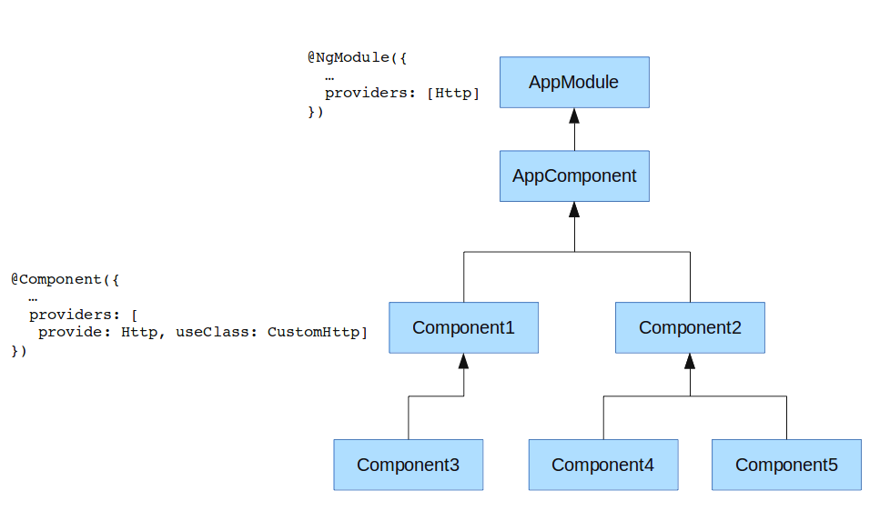

# Injection de<br>Dépendances

<!-- .slide: class="page-title" -->

Notes :


## Sommaire

<!-- .slide: class="toc" -->

- [Rappels](#/1)
- [Présentation](#/2)
- [Démarrer une application Angular](#/3)
- [Tests](#/4)
- [Template & Composants](#/5)
- [Les directives](#/6)
- **[Injection de Dépendances](#/7)**
- [Les Pipes](#/8)
- [Service HTTP](#/9)
- [Router](#/10)
- [Gestion des Formulaires](#/11)
- [Server-side Rendering](#/12)

Notes :


## Injecteurs

- Élément utilisé pour injecter les services
- Possibilité d'un injecteur par composant contrairement à *AngularJS* (un unique injecteur global)
- Les composants héritent de l'injecteur de leur parent
- Nécessité de configurer les injecteurs
    - de manière globale via le module principal `@NgModule`
    - de manière locale via `@Component`
- Les services sont injectés via la constructeur du parent et sont des singletons **au sein du même injecteur**

Notes :


## Configuration globale de l'Injecteur

- `@NgModule` a un paramètre `providers`: un tableau de `providers`
- Les `providers` définit dans un `NgModule` sont injectables partout dans l'application

```typescript
// fichier application.component.ts
import { UserService } from './user.service'

@Component({ ... })
export class AppComponent {
    constructor(userService: UserService){
        console.log(userService.getUser());
    }
}

// fichier app.module.ts
import { UserService } from './services/user.service';

@NgModule({
  providers: [ UserService ],
})
export class AppModule { }
```

Notes :


## Configuration locale de l'Injecteur

- Possibilité de définir une propriété `providers` dans l'annotation `@Component`
- Même syntaxe que la configuration globale
- Les `providers` définit dans un `Component` sont injectables dans ce component et ses fils

```typescript
// fichier application.component.ts
import { UserService } from './user.service'

@Component({
    providers: [ UserService ]
})
export class AppComponent {
    constructor(userService: UserService){
        console.log(userService.getUser());
    }
}
```

Notes :


## Dépendances des services

- Nécessité d'ajouter l'annotation `@Injectable`
- Utilisée pour que *Angular* puisse générer les métadatas nécessaires pour l'injection de dépendances
- Inutile pour les composants, car nous utilisons déjà `@Component`

```typescript
import { Injectable } from '@angular/core';
import { Logger } from './logger-service';

@Injectable()
export class UserService {

    constructor(public logger:Logger){

    }
    myMethod(){ ... }

}
```

Notes :
- La documentation précise que c'est une (très) bonne pratique d'annoter tous les services avec @Injectable, même ceux n'ayant aucune dépendance (voir ici : https://angular.io/docs/ts/latest/guide/dependency-injection.html).
- Possibilité d'avoir des dépendances optionnelles (en utilisant l'annotation @Optional() sur le paramètre).


## Configurer les providers

- Plusieurs syntaxes existent pour définir les providers
- L'identifiant du provider peut être un objet, une chaîne de caractères ou un `InjectionToken`

```typescript
export function serverConfigFactory(appService: AppService){
    return appService.getConfig();
}
@NgModule({
    providers: [
      UserService, 
      { provide: LoginService, useClass: LoginService },
      {
          provide: ServerConfig,
          useFactory: serverConfigFactory
          deps: [AppService]
      }
    ]
})
export class AppModule { }
```

Notes :


## Configurer les providers

- Lorsque nous avons des objets à injecter, et non des classes
- Possibilité de définir une chaîne de caractère comme identifiant
- Utilisation de l'objet `InjectionToken` de préférence
- Nécessité d'utiliser l'annotation `Inject` pour injecter ce genre de service

```typescript
let apiUrl: string = 'api.heroes.com';
let env: string = 'dev';

@NgModule({
  providers: [{provide: 'apiUrl', useValue:apiUrl},{provide: 'env', useValue:env}],
})
export class AppModule { }

class AppComponent {
    constructor(@Inject('apiUrl') api:string) { ... }
}
```

Notes :


## Hiérarchie d'injecteurs

 - Chaque composant peut définir un injecteur avec un certain nombre de providers
 - Chaque provider fournit un singleton d'un service 
 - Si un composant a besoin d'un service mais que son injecteur n'a pas de provider correspondant, il demande à l'injecteur de son parent


## Hiérarchie d'injecteurs



Notes :
  - Service Http définit comme singleton pour l'appli, il sera utilisé par AppComponent, Component2, Component4, Component5
  - Si Component1 ou Component3 injecte Http, c'est un CustomHttp qui sera injecté (singleton pour Component1 et Component3)
  - Si Component3 définit aussi le même tableau de provider que Component3, alors chacun aura une instance différente de CustomHttp


## Injection de Dépendances - Tests

- Possibilité de bénéficier de l'injection de dépendance grâce à la méthode `inject`
- Définition des services injectés dans les tests via la méthode `configureTestingModule` de l'objet `TestBed` (propriété `providers`)
- Méthode `async` utilisée pour tester les services asynchrones (utilise le méchanisme de *Zone*)

```typescript
import {TestBed, async, inject} from '@angular/core/testing';

describe('UserService', () => {
  beforeEach(() => {
    TestBed.configureTestingModule({ providers: [UserService] });
  });

  it('should return 1 user', async(inject([UserService], service => {
    service.getUsers().then(users => {
      expect(users.length).toBe(1);
    });
  })));
});
```

Notes :


<!-- .slide: class="page-questions" -->


<!-- .slide: class="page-tp5" -->
