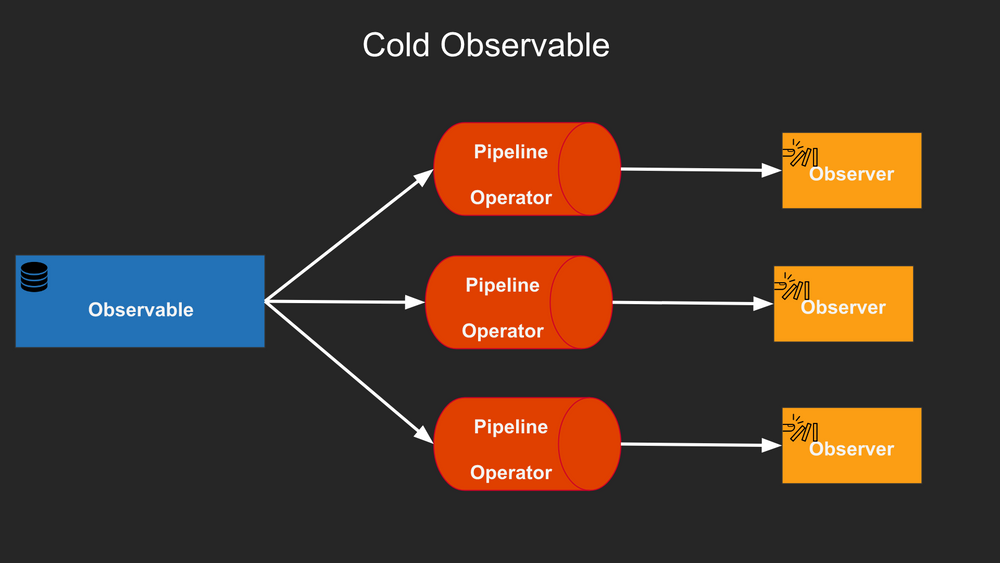

# Http

<!-- .slide: class="page-title" -->


## Summary

<!-- .slide: class="toc" -->

- [Introduction](#/1)
- [Reminders](#/2)
- [Getting started with Angular](#/3)
- [Components](#/4)
- [Unit testing](#/5)
- [Directives](#/6)
- [Services](#/7)
- [Pipes](#/8)
- **[Http](#/9)**
- [Router](#/10)
- [Forms](#/11)

Notes :


## Http - Getting started

Suppose our application needs to display todo items from the `jsonplaceholder` API

- Here's the shape of a `Todo` item...

```ts
interface Todo {
  id: number;
  title: string;
  completed: boolean;
}
```

- ...and the API response for `id` 1

```json
{ "id": 1, "title": "delectus aut autem", "completed": false }
```

Notes :


## Http - Getting started

- To add Http capabilities to Angular, we need first to import the `HttpClientModule`...

```ts
import { NgModule } from '@angular/core';
import { HttpClientModule } from '@angular/common/http';

@NgModule({
  imports: [HttpClientModule]
})
export class AppModule {}
```

Notes :


## Http - Getting started

- ...and then use the `HttpClient` service in our components

```ts
import { Component, OnInit, Input } from '@angular/core';
import { HttpClient } from '@angular/common/http';

@Component({
  selector: 'app-todo',
  template: '<p>{{ todo?.title }}</p>'
})
export class TodoComponent implements OnInit {
  todo?: Todo;

  constructor(private httpClient: HttpClient) {}

  ngOnInit(): void {
    this.httpClient
      .get<Todo>('https://jsonplaceholder.typicode.com/todos/1')
      .subscribe((todo) => (this.todo = todo));
  }
}
```

Notes :


## Http - Getting started

- Let's take a look at the interface of the `httpClient.get` method:

```ts
export declare class HttpClient {
  get<T>(url: string, options?: { /* ... */ }): Observable<T>;
}
```

What is an `Observable` ?

Notes :


## RxJS - Introduction

- Observables
  - represent a stream of data that can be subscribed to
  - allowing multiple values to be emitted over time

- Refers to a paradigm called ReactiveX (http://reactivex.io/)
  - an API for asynchronous programming with observable streams
  - implemented in all major programming languages: RxJava, Rx.NET, RxJS, ...

Angular relies a lot on the notion of Observable, powered by the library *RxJS*.


Notes :


## RxJS - Observable & Observer

An `observable` is a stream. Data navigate in it. There can be no data, one data or multiple data going throught it as time goes by.

An `observer` is a listener. It `subscribes` to an `observable` to be notified when new data are received.



Notes :


## Http - Adding a listener

<div>

```ts
import { Component, OnInit, Input } from '@angular/core';
import { HttpClient } from '@angular/common/http';

@Component({
  selector: 'app-todo',
  template: '<p>{{ todo?.title }}</p>'
})
export class TodoComponent implements OnInit {
  todo?: Todo;

  constructor(private httpClient: HttpClient) {}

  ngOnInit(): void {
    this.httpClient
      .get<Todo>('https://jsonplaceholder.typicode.com/todos/1')
      .subscribe((todo) => (this.todo = todo));
  }
}
```

</div>

Notes :


## Http - call without a listener

What whould happen if there is no listener on your Observable ? 

<div>

```ts
import { Component, OnInit, Input } from '@angular/core';
import { HttpClient } from '@angular/common/http';

@Component({
  selector: 'app-todo',
  template: '<p>{{ todo?.title }}</p>'
})
export class TodoComponent implements OnInit {
  todo?: Todo;

  constructor(private httpClient: HttpClient) {}

  ngOnInit(): void {
    this.httpClient.get<Todo>('https://jsonplaceholder.typicode.com/todos/1');
  }
}
```

</div>

Notes :


<!-- .slide: class="page-tp7.1" -->


## RxJS - Operators

What are operators ?

> Operators are the essential pieces that allow complex asynchronous code to be easily composed in a declarative manner.

- Functions
- Takes an `Observable` as an input, creates a new `Observable` as an output
- Are commonly used to manipulate data going through an `Observable`
- Can be chained


## RxJS - Operators | synchronous

<div>

```ts
import {
  Observable, filter, map // <-- "filter" and "map" are synchronous transformations
} from 'rxjs';

const data$ = new Observable<number>((observer) => {
  observer.next(1);
  observer.next(2);
  observer.next(3);
  observer.next(4);
  observer.complete();
});

data$.pipe(/* no operator */).subscribe(console.log);                 // output: 1, 2, 3, 4

data$.pipe(filter((data) => data % 2 === 0)).subscribe(console.log);  // output: 2, 4

data$.pipe(map((data) => data * 10)).subscribe(console.log);          // output: 10, 20, 30, 40

data$.pipe(
  filter((data) => data % 2 === 0),
  map((data) => data * 10)
).subscribe(console.log);                                             // output: 20, 40
```

</div>

Notes :


<!-- .slide: class="page-tp7.2" -->


## Http - Testing 1/2

- Angular provides `HttpClientTestingModule` and `HttpTestingController` for mocking the Http module

```ts
import { HttpClientTestingModule, HttpTestingController } from '@angular/common/http/testing';
import { TestBed } from '@angular/core/testing';

describe('ApiService', () => {
  let service: ApiService;
  let httpTestingController: HttpTestingController;

  beforeEach(() => {
    TestBed.configureTestingModule({
      imports: [HttpClientTestingModule],
    });

    service = TestBed.inject(ApiService);
    httpTestingController = TestBed.inject(HttpTestingController);
  });
});
```

Notes :


## Http - Testing 2/2

- The Controller can be injected into tests and used for mocking and flushing requests

```ts
import { HttpClientTestingModule, HttpTestingController } from '@angular/common/http/testing';
import { TestBed } from '@angular/core/testing';

describe('ApiService', () => {
  // ...

  it('should fetch the products', () => {
    const responseMock: Product[] = [{ id: 'ID_1' } as Product, { id: 'ID_2' } as Product];

    service.fetchProducts().subscribe((products) => expect(products).toEqual(responseMock));

    const req = httpTestingController.expectOne('http://localhost:8080/api/products');
    expect(req.request.method).toEqual('GET');
    req.flush(responseMock);

    httpTestingController.verify(); // assert that there are no outstanding requests
  });
});
```

Notes :


<!-- .slide: class="page-questions" -->