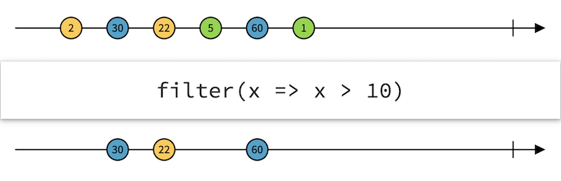
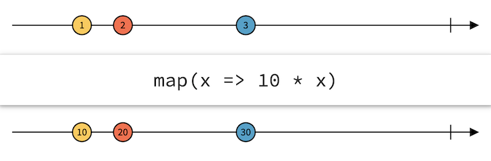

# HTTP service

<!-- .slide: class="page-title" -->

Notes :


## Summary

<!-- .slide: class="toc" -->

- [Reminders](#/1)
- [Introduction](#/2)
- [Start an Angular application](#/3)
- [Tests](#/4)
- [Template & Components](#/5)
- [Directives](#/6)
- [Dependency Injection](#/7)
- [Pipes](#/8)
- **[HTTP Service](#/9)**
- [Router](#/10)
- [Forms](#/11)
- [Server-side Rendering](#/12)

Notes :


## RxJS

- *Angular* has a strong dependency on the library *RxJS 6 +*
- It is very used in the heart of the framework
- *RxJS* is a library for **Reactive Programming**
- It's a new paradigm of programming very fashionable
- There are many implementations: http://reactivex.io/
- Documentaion for *RxJS*: https://github.com/ReactiveX/rxjs


## Observables

- `Observable` are the central notion in the library *RxJS*
- They represent a flow of data, we often speak of **stream**
- Allows the processing of asynchronous tasks similar to tables
- Replaces the use of promises that were in *AngularJS*
- Provides advantages over promises
  - Allows you to have asynchronous processing that returns multiple data
  - An Observable can be *cancelable*
  - Offers many tools to process data
- Usable for all asynchronous processing

  HTTP requests, WebSocket, event management

Notes :


## Observables

- *RxJS* provides an important list of operators for `Observable`
- These operators are largely inspired by transformations on a board
  - `take(n)`: draws the first n elements and cuts the flow
  - `filter(fn)`: pass events for which fn makes `true`
  - `map(fn)`: apply the function fn on each element and return the result
  - `merge(s1, s2)`: merges source with observables as argument
  - `mergeMap(fn)`: apply fn as map but merge values ​​that are observables
  - `debounce(ms)`: delay and filter to send an element only when there have been no new elements since the argument time
- Important resource for learning operators: http://rxmarbles.com/

Notes :


## Marbles diagrams





Notes :
 
 

## Observables pipe (RXJS 6)

- Since rxjs 6, operators are no longer directly available in the Observable object, but as a function.
- You have to use `pipe`, to call the operators:
```typescript
import { map, filter } from 'rxjs/operators';

observable.pipe(
    map(fn),
    filter(fn),
    ...
)
```
- Attention, some operators have been renamed between version 5 and 6 of RXJS (it was javascript keywords):
- `do`, `catch`, `switch`, `finally` become `tap`, `catchError`, `switchAll`, and `finalize`


## Subscriptions

- To listen to the result of a stream, use the `subscribe` method
- **Warning**
  - `subscribe` is not an operator, it can not be chained
  - It makes a `subscription` object that allows you to stop listening
  - An observable that has not been **subscribed** does not **start**
  - An observable can only be listened to once
- `subscribe` takes three functions in arguments, all optional
  - `next`: Called for each element in the stream
  - `error`: Called for each error in the stream
  - `complete`: Called when closing the stream

Notes :


## Example

- Complete example of using Observables

```typescript
function getDataFromNetwork(): Observable<SomeClass> {
  / *... */
}

function getDataFromAnotherRequest(arg: SomeClass): Observable<SomeOtherClass> {
  / *... */
}

getDataFromNetwork ()
  .pipe(
    filter((rep1: SomeClass) => rep1 !== null),
    mergeMap((rep1: SomeClass) => getDataFromAnotherRequest(rep1)),
    map((rep2: SomeOtherClass) => `${rep2} transformed`)
  )
  .subscribe((value: string) => console.log(`next => ${value}`));
```

Notes :


## Creation

- There are many initializers from a table for example
- Possibility also to create one via the constructor

```typescript
import { Component, OnDestroy } from "@angular/core";
import { Observable, Subscriber } from "rxjs";

@Component ({...})
export class AppComponent implements OnDestroy {
  private subscriber: Subscriber;

  constructor() {
    const source = new Observable(observer => {
      const interval = setInterval(() => observer.next('TICK'), 1000);
      return () => {
        observer.complete();
        clearInterval(interval);
      };
    });
    this.subscriber = source.subscribe(value => console.log(value));
  }

  ngOnDestroy() { this.subscriber.unsubscribe(); }
}
```

Notes :


## RxJS and Angular

- *Angular* uses a lot *RxJS* internally
- The dependency is in **peer mode** that is to say it is to be added in addition
- **Attention**, you need version *6 +* (since Angular 6), while *5* is still widespread
- *Angular* exposes *RxJS* objects in several cases:
  - HTTP requests
  - Interaction with a form
  - View views by the *router*
- *ngrx* is a project that proposes to extend the use of Rx with Angular
  - *@ngrx/store*, *@ngrx/devtools*, *@ngrx/router*, ...

Notes :


## HTTP

- *Angular* provides a `HttpClientModule` module dedicated to HTTP communication
- This module contains a service set for HTTP requests
- Before *Angular 4.3*, using the `HttpModule` module
- Based on the `Observable` pattern
  - Unlike AngularJS who used the `Promises` pattern
  - Greater flexibility thanks to the different operators of `RxJS`
- The entry point is the `HttpClient` service accessible via the dependency injection
- Numerous configurations to configure or transform requests
- Best practice: Implementing REST calls in services

Notes :


## HTTP - Example

- Example of a service using `HttpClient`
- Think about importing `HttpClientModule` into your module
- Import the `HttpClient` class from the `@angular/common/http` module
- Injection of the service via the constructor
- The service method will return the observable of the request to HTTP

```typescript
import {Injectable} from '@angular/core';
import {HttpClient} from '@angular/common/http';
import {Observable} from 'rxjs';
import {Person} from './model/person';

@Injectable()
export class ContactService {
  constructor(private http: HttpClient) {}

  getContacts(): Observable<Person[]> {
    return this.http.get<Person []>('people.json');
  }
}
```

Notes :


## HTTP - Configuration

- The HTTP request can be configured via an additional parameter

```typescript
interface RequestOptionsArgs {
  body?: any;
  headers?: Headers;
  observe?: 'body';
  reportProgress?: boolean:
  withCredentials?: boolean;
  responseType?: ResponseContentType;
}
```

Notes :


## HTTP - Configuration

- `HttpClient` also offers many shortcuts

```typescript
class HttpClient {
  request(url: string | Request, options?: RequestOptionsArgs): Observable<any>

  get(url: string, options?: RequestOptionsArgs): Observable<any>

  post(url: string, body: any, options?: RequestOptionsArgs): Observable<any>

  put(url: string, body: any, options?: RequestOptionsArgs): Observable<any>

  delete(url: string, options?: RequestOptionsArgs): Observable<any>
  / *... */
}
```

Notes :


## HTTP - Example

HTTP request of `PUT` type with overload of `Headers`

```typescript
import {Injectable} from '@angular/core';
import {HttpClient, HttpHeaders} from '@angular/common/http';
import {Observable} from 'rxjs';
import {Contact} from './model/contact';

Injectable()
export class ContactService {
  constructor(private http: HttpClient) {}

  save(contact: Contact): Observable<Contact> {
    const headers = new HttpHeaders ();
    headers.set('Authorization', 'xxxxxxx');

    const requestOptions: RequestOptionsArgs = {
      headers
    };
    return this.http.put(`rest/contacts/${contact.id}`, contact, requestOptions);
  }
}
```

Notes :


## HTTP - Example

- Example with the use of operators *RxJS*

```typescript
import {Component} from '@angular/core';
import {ContactService} from './contact.service';

@Component ({
  selector: 'app',
  template: '{{displayedData | json}} '
})
export class AppComponent {
  displayedData: Array<Contact>;

  constructor(private contactService: ContactService) {
    contactService.getContacts().subscribe(contacts => {
      this.displayedData = contacts;
    });
  }
}
```

Notes :


## HTTP - Example

- Example using more operators

```typescript
import {HttpClient} from '@angular/common/http';
import {Component} from '@angular/core';
import {Project, Person} from './model/';
import {Observable} from 'rxjs';
import {mergeMap} from 'rxjs/operators';

@Component ({
  selector: 'app',
  template: `
  <ul>
    <li *ngFor="let project of (projects$ | async)"> {{project.name}} </li>
  </ul> `
})
export class AppComponent {
  projects$: Observable<Project[]>
  constructor(http: HttpClient) {
    this.projects$ = http.get<Person[]>('person.json')
      .pipe(
        mergeMap((persons: Person []): Observable<Project[]> => 
            getProjects(persons))
      )
  }
}
```

Notes :


## HTTP - Interceptors

- Possibility of creating interceptors
- Will apply on queries and responses

```typescript
import {
  HttpInterceptor,
  HttpRequest,
  HttpHandler,
  HttpEvent
} from '@angular/common/http';
import {Observable} from 'rxjs';

@Injectable()
export class HeaderInterceptor implements HttpInterceptor {

  intercept(req: HttpRequest<any>, next: HttpHandler): Observable<HttpEvent<any>> {
    const clone = req.clone({
        setHeaders: {'Authorization': `token ${TOKEN}`}
    });
    return next.handle(clone);
  }

}
```

Notes :


## HTTP - Interceptors

- Recording the interceptors via the `HTTP_INTERCEPTORS` token in the module configuration

```typescript
import {NgModule} from '@angular/core';
import {HTTP_INTERCEPTORS} from '@angular/common/http';
import {HeaderInterceptor} from './header.interceptor';

@NgModule ({
  providers: [{
    provide: HTTP_INTERCEPTORS,
    useClass: HeaderInterceptor,
    multi: true,
  }],
})
export class AppModule {}
```

Notes :


## HTTP - Tests

- *Angular* offers a test module for the querying system: `HttpClientTestingModule`

```typescript
import {TestBed} from '@angular/core/testing';
import {HttpClientTestingModule} from '@angular/common/http/testing';

describe('UserService', () => {
  beforeEach (() => TestBed.configureTestingModule ({
    imports: [HttpClientTestingModule],
    providers: [UserService]
  }));

  / *... */
});
```

Notes :


## HTTP - Tests

- `HttpTestingController` allows to program queries and their answers

```typescript
import {
  HttpClientTestingModule,
  HttpTestingController
} from '@angular/common/http/testing';
import {TestBed, waitForAsync} from '@angular/core/testing';

/ *... */

it ('should return 1 user', waitForAsync (
  () => {
    const userService = TestBed.inject(UserService);
    const http = TestBed.inject(HttpTestingController);
    const mockedUsers = [{name: 'Zenika'}];

    userService.getUsers().subscribe((users: User []) => {
      expect(users.length).toBe(1);
    });

    http.expectOne('/api/users').flush(mockedUsers)
  }
)));
```

Notes :


<!-- .slide: class="page-tp7" -->
