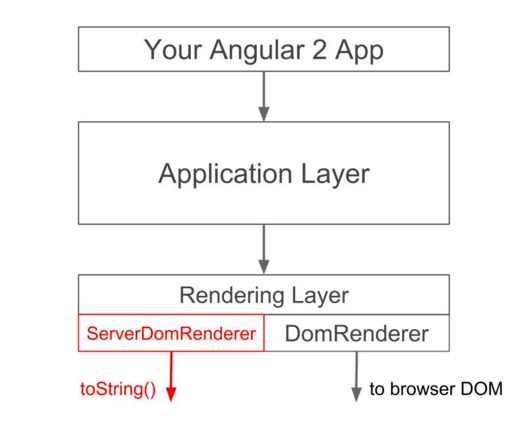

# Server-side Rendering

<!-- .slide: class="page-title" -->

Notes :


## Summary

<!-- .slide: class="toc" -->

- [Reminders](#/1)
- [Introduction](#/2)
- [Start an Angular application](#/3)
- [Tests](#/4)
- [Template & Components](#/5)
- [Directives](#/6)
- [Dependency Injection](#/7)
- [Pipes](#/8)
- [HTTP Service](#/9)
- [Router](#/10)
- [Forms](#/11)
- **[Server-side Rendering](#/12)**

Notes :


## Need

- Indexing by search engines (SEO)
- Preview (as in facebook share)
- Progressive improvement
  - Propose a simple version for everyone
  - Enrich the experience according to the customer

- *Speed up application loading*

Notes :


## Angular Universal

- Official Angular Project
- Integrated with the main project since Angular 4.0.0
- Contains two modules
  - Rendering an Angular Server Side Application (Node.js)
  - The second records the actions of the user to replay them once the interface is fully loaded
- The term Universal comes from the idea of ​​being able to offer the application in environments other than that of the browser


Notes :


## Mechanism

- `AngularJS` strongly linked to the DOM
- `Angular` introduces a separation of the rendering mechanism




Notes :


## Rendering procedure

- The rendering engine (Express in Node.js) will build the HTML
- *Angular Universal plugin* will realize the bootstrap of the application
- The answer of the REST calls is expected
- The completely constructed page is returned to the user
- *Angular Universal* `Preboot` library records user actions
- The client browser finishes loading the JavaScript code
- `Preboot` library replays user actions

Notes :
- Only Express for now. The development team evokes the wish that other engine proposes this (Apache ...)


## Setting up

- The easiest way is to take back the starter

  https://github.com/angular/universal-starter

- Uses two entry points for the application
  - Classic for the client with the `bootstrap` function
  - For the server with the setting up of `Express` and `Angular Universal`

Notes :


## Server rendering

- Preview of *Angular* configuration in *Express*

```typescript
const express = require('express');
const ngUniversal = require('@nguniversal/express-engine');

const renderModuleFactory = require('@angular/platform-server').renderModuleFactory;

const appServer = require('./ dist-server/main.bundle');

const app = express();

app.get('/', function angularRouter(req, res) {
   res.render('index', {req, res});
});

app.use(express.static(`dirname$(__}/dist`));

app.engine('html', ngUniversal.ngExpressEngine({
  bootstrap: appServer.AppServerModuleNgFactory
}));
app.set('view engine', 'html');
app.set('views', 'dist');
```

Notes :


<!-- .slide: class="page-questions" -->
