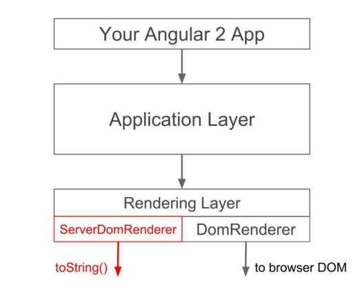

# Server-side Rendering

<!-- .slide: class="page-title" -->

Notes :


## Sommaire

<!-- .slide: class="toc" -->

- [Rappels](#/1)
- [Présentation](#/2)
- [Démarrer une application Angular2](#/3)
- [Tests](#/4)
- [Template, Directives & Composants](#/5)
- [Les composants Angular2](#/6)
- [Injection de Dépendances](#/7)
- [Les Pipes](#/8)
- [Service HTTP](#/9)
- [Router](#/10)
- [Gestion des Formulaires](#/11)
- **[Server-side Rendering](#/12)**
- [Bonnes Pratiques pour une migration heureuse](#/13)
- [Angular2 en EcmaScript 5](#/14)

Notes :


## Besoin

- Indexation par les moteurs de recherche (SEO)
- Prévisualisation (comme dans le partage facebook)
- Amélioration progressive
  - Proposer une version simple pour tous
  - Enrichir l'expérience en fonction du client
  
- *Accélérer le chargement de l'application*

Notes :


## Angular Universal

- Projet Angular officiel. Contrairement aux projets de Server Side Rendering pour `AngularJS`
- Contient deux modules
  - Le premier rend le code coté serveur
  - Le deuxieme enregistre les actions de l'utilisateur pour les rejouer une fois l'interface complètement chargé
- Le terme Universal vient de l'idée de pouvoir proposer l'application dans d'autres environnements que celui du navigateur
- Pas encore assez stable pour la mise en production


Notes :


## Méchanisme

- `AngularJS` fortement lié au DOM
- `Angular 2` introduit une séparation du mécanisme de rendu




Notes :


## Procédure de rendu

- Le moteur de rendu (Express en NodeJS) va construire le HTML
- Le plugin `Angular Universal` va réaliser le `bootstrap` de l'application
- La réponse des appels REST est attendue
- La page complètement construite est retourné à l'utilisateur
- La librairie `Preboot` de `Angular Universal` enregistre les actions de l'utilisateur
- Le navigateur client termine de charger le code javascript
- La librairie `Preboot` rejoue les actions de l'utilisateur

Notes :
- Uniquement Express pour l'instant. L'équipe de développement évoque le souhait que d'autre moteur propose cela (Apache...)


## Mise en place

- Le plus simple est de reprendre le starter
https://github.com/angular/universal-starter

- Créer deux points d'entrées pour l'application
  - Classique pour le client avec la fonction `bootstrap`
  - Pour le serveur avec la mise en place de `Express` et de `Angular Universal`

Notes :


## Rendu serveur

Elements notables du script de lancement du serveur

```typescript
import * as express from 'express';
import {ng2engine, ...} from 'angular2-universal-preview';
import {App} from './app/app';

let app = express();
app.engine('.html', ng2engine); // définit le plugin
app.use('/', function (req, res) { // enrichie les traitements sur la requête  
  res.render('index', {
    App, // ng2engine va récupérer ces variables et réaliser le bootstrap
    providers: [...],
    preboot: true
 });
});
```

Notes :


<!-- .slide: class="page-questions" -->
